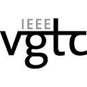
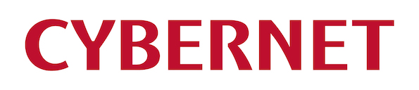



The 15th IEEE Pacific Visualization Symposium will be held from April 11, 2022, through April 14. PacificVis 2022 was planned as a regular conference, then in a hybrid form. The current developments of the global and domestic health crisis made it increasingly unlikely that the physical meeting could take place. PacificVis 2022 moves to a full-online conference. We will welcome the visualization community with excitement and hospitality in a virtual format.

Visualization has become an increasingly important research area due to its wide range of applications in many disciplines. PacificVis is an IEEE sponsored international visualization symposium held in the Asia-Pacific region, with the objective to foster greater exchange between visualization researchers and practitioners, and to draw more researchers in the Asia-Pacific region to enter this rapidly growing area of research.

PacificVis is a unified visualization symposium, welcoming all areas of visualization research such as: information visualization, scientific visualization, graph and network visualization, visual analytics, and specific applications such as (but not limited to) security-, software- and bio-visualization. Authors are invited to submit original and unpublished research and application papers in all areas of visualization. We encourage papers in any new, novel, and exciting research area that pertains to visualization.

# News

- [List of papers and notes are available]({{site.baseurl}}/program/accepted).  Don't miss the paper previews! (2022-03-17)
- [Let's watch at four beautiful visual data stories](https://pvis2022.github.io/pvis2022/program/contest/)!  (2022-03-15)
- [We welcome your registration]({{site.baseurl}}/registration/). (2022-03-11)

<!--
# Welcome to PacificVis 2022!

General Conference Chair 
 
<strong>Kazuo Misue</strong> 
University of Tsukuba

Organization Chair 
 
<strong>Naohisa Sakamoto Misue</strong> 
Kobe University

-->

# Keynotes

- Daniel Weiskopf, "[Multidimensional Visualization]({{ site.baseurl }}/program/keynotes/#danielweiskopf)"

- Wei Chen, "[When Visualization Meets Privacy]({{ site.baseurl }}/program/keynotes/#weichen)"



<!-- Moved to pages/committees.md -->

# Conference Committees



  
    

{{ member.Role }}

  

  
 
  
 
  
<strong>{{ member.First }} {{ member.Given }}</strong> 
{{ member.Affiliation }}





---

# Sponsors

<table align="center" border="0" cellpadding="0" cellspacing="0">
    <tr bordercolor="red">
        <td width="33%">
           
        </td>
        <td width="33%">
           
        </td>    
        <td height="33%">
           
        </td>
    </tr>
    <tr>
        <td>
           
        </td>
        <td>
           
        </td>
    </tr>
</table>

# Academic Sponsors

---
